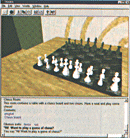
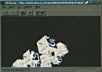
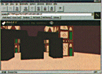
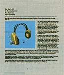
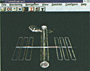

# 사이버스페이스로 가는 통로: VRML의 과거와 현재, 미래
>
> **인터넷 표준 3차원 그래픽스 기술의 태동과 발전 방향**

#### **출처: Internet Magazine**

---

## 1. 서론

1994년 초반까지만 해도 인터넷은 일반인들이 쉽게 접할 수 없는 미지의 영역이었습니다. 당시만 해도 전 세계를 실시간으로 연결하는 글로벌 네트워크망과 무료 사용 환경은 대중에게 상상하기 어려운 미래의 기술이었습니다.

그러나 오늘날 인터넷은 미디어를 막론하고 우리 일상에서 가장 흔하게 접하는 단어가 되었습니다. 이처럼 인터넷이 대중화되는 데 핵심적인 역할을 한 주역이 바로 **WWW(World Wide Web)**과 **HTML**입니다.

### 텍스트 환경에서 WWW(World Wide Web)으로

WWW은 1989년 CERN(유럽 입자물리학 연구소)의 네트워크 하이퍼미디어 연구로 출발하여, 1993년 최초의 웹 브라우저인 **NCSA Mosaic**이 출시되면서 대중에게 처음 공개되었습니다.

* **URL의 고안**: 인터넷상의 모든 데이터에 고유 주소를 부여하는 표준 체계 확립
* **HTML의 등장**: 텍스트, 이미지(GIF, JPG), 사운드(WAV, MID), 동영상(AVI, MOV) 등 서로 다른 포맷의 이종 데이터를 하이퍼텍스트 링크 구조로 통합하여 하나의 브라우저 안에서 처리할 수 있는 환경 제공

이러한 데이터의 통합 처리 흐름은 자연스럽게 차세대 정보 표현 방식인 **3차원 가상세계** 구현에 대한 논의로 이어졌습니다.

---

## 2. WWW에서 VRML로

### 2.1. 가상 가상세계 표준의 논의 시작

93년 말부터 94년 초 사이, 세계 곳곳의 연구자들은 인터넷 기반의 3차원 가상공간을 연구하기 시작했습니다. 1994년 3월 제1차 WWW 학술대회(스위스 제네바)에서 3차원 웹 방식에 대한 첫 토론이 진행되었으며, 이후 WIRED 매거진의 온라인 서비스인 '핫 와이어드(HotWired)' 호스트에 공식 메일링 리스트가 개설되면서 본격적인 표준화 규격 설정이 추진되었습니다.

* **최초의 가상세계 논의 공간**: [Wired-VRML](http://vrml.wired.com)

### 2.2. 네트워크 환경을 고려한 설계 원칙

컴퓨터 그래픽스 분야에서 널리 쓰이던 DXF, 3DS 등의 포맷은 파일 크기가 커 대역폭이 좁은 네트워크 전송 환경에 부적합했습니다. 이에 따라 새로운 3D 표준은 다음과 같은 제약사항과 목표를 기반으로 설계되었습니다.

1. **데이터 최적화**: 좁은 대역폭에서도 빠르게 전송되도록 가벼운 텍스트 기반 폴리곤 데이터 형식을 취할 것
2. **단순화된 기능셋**: 가상 가상세계를 유지하는 데 필요한 최소한의 기능으로 구성을 단순화할 것
3. **확장성**: 추후 새로운 명세 및 확장 노드를 원활히 통합할 수 있을 것

### 2.3. VRML 1.0의 탄생

Wired-VRML의 표준안 투표 과정을 거쳐 1994년 11월 **VRML 1.0 사양의 초안**이 발표되었습니다. VRML 1.0은 Silicon Graphics(SGI)사의 **오픈 인벤터(Open Inventor)** 포맷을 근간으로 하여 복잡한 렌더링 노드를 걷어내고 3D 공간 안에서 인터넷 링크로 전환할 수 있는 **URL 참조 기능**을 삽입해 개발되었습니다.

이어 1995년 3월, SGI에서 최초의 VRML 브라우저인 **WebSpace**를 선보이며 일반인에게 알려지기 시작했습니다.

---

## 3. VRML, 어디로 갈 것인가

### 3.1. VRML 1.0의 한계

VRML 1.0이 개척한 가상세계는 엄밀히 말해 정적인 공간에 가깝습니다.

* 다중 접속자 지원 불가 (싱글 유저 환경)
* 정적 오브젝트 배치 위주로 실시간 객체 조작 및 인터랙션의 한계
* 단지 링크(Link) 기능을 적용한 3D 데이터 뷰어 수준에 머무름

### 3.2. VRML 2.0으로의 패러다임 변화 (인터랙션과 동적 행동 제어)

이상적인 가상현실은 정교한 3D 가상 공간 안에서 물리 법칙이 작동하고, 실시간 통신을 통해 다자간 교류가 가능하며, 객체들이 스스로 움직일 수 있는 공간이어야 합니다.

이러한 한계를 극복하고 완성도 높은 가상 세계를 조율하기 위해 현재 두 가지 트랙의 연구개발이 지속되고 있습니다.

1. **마이너 업데이트 (VRML 1.1)**: 기존 구조를 유지하되 카메라 뷰포인트 전환, 정교한 텍스처 매핑 및 정밀 위치 제어를 보완하는 수준의 개정안
2. **행동 양식 제어 (VRML 2.0)**: 오브젝트에 독립적인 애니메이션이나 사용자의 동작에 반응하는 스크립트를 내장하기 위한 **행동 코드 프로그래밍 언어의 통합 도입**

---

## 4. 국내외 기술 개발 동향

### 4.1. 국내 다자간 3차원 채팅 브라우저 개발

국내에서도 한국과학기술원(KAIST) 전산학과 인공지능연구센터 원광연 교수 연구팀이 **동시 사용자 접속 및 대화가 가능한 3차원 웹 브라우저**를 개발하는 성과를 거두었습니다.

* **주요 특징**: 고정된 3차원 공간을 혼자 탐색하는 해외 브라우저와 달리 다중 접속자가 아바타(대리자 모델)를 선택하여 실시간 채팅 및 공간 공유 가능
* **아키텍처**: 독자적인 경량 포맷을 적용하여 표준 HTTP 상에서 추가 시스템 확장 없이 연동

### 4.2. 자바(JAVA)와 VRML의 결합 흐름

3D 정적 구조물을 묘사하는 데 특화된 VRML과 동적인 데이터 제어 및 프로그램 구동을 지원하는 자바의 결합은 필연적인 방향입니다.

* **Dimension X사의 시도**: 자바와 VRML을 동시에 지원하는 렌더링 솔루션 **'Liquid Reality'** 및 GUI 기반 무코드 애니메이션 저작 도구인 **'JAM(Java Animation Machine)'**을 출시하여 가상현실 내 동적 인프라 저변 확대

---

## 5. VRML 브라우저 분석 (주요 플랫폼별 비교)

인터넷상에서 가상현실을 구현하는 대표적인 브라우저와 뷰어의 세부 스펙은 다음과 같습니다.

### 5.1. 전용 독립 브라우저 및 헬퍼 애플리케이션

| 브라우저명 | 개발사 | 주요 지원 플랫폼 | 주요 특징 및 한계점 |
| :--- | :--- | :--- | :--- |
| **AmberGL 1.0** | DIVE Laboratories | Windows NT | OpenGL 기반 고품질 렌더링, 실시간 렌더링 품질 변경 옵션 제공 (단, 초기 텍스처/원기둥 노드 누락) |
| **Fountain** | Caligari Corp | Windows 3.1, NT | VRML 전용 저작(Authoring) 기능 통합, 빠른 인터랙션 렌더링 엔진 탑재 |
| **GLView** | Holger Grahn | Windows 95, NT | DXF, 3DV, OBJ 등 이기종 3D 데이터를 VRML 포맷으로 상호 변환 및 OpenGL 가속 지원 |
| **Pueblo (Beta)**  | Chaco Comm. | Windows 95, NT | 하이퍼미디어 머드(MUD) 게임 클라이언트 연계형 브라우저 |
| **VR Scout 1.2**  | Chaco Comm. | Windows 3.1, 95, NT | Netscape 플러그인 호환, GZIP/ZIP 압축 해제 노드 자동 디코딩 탑재 |
| **VRealm** | Integrated Data System | Windows 95, NT | SGI Open Inventor 전용 규격 지원, VRealm Builder 저작 도구 연계 제공 |
| **VRWeb** | IICM, NASA | Windows, Linux, Solaris, AIX, IRIX | 소스코드 오픈소스로 공개, 크로스 플랫폼 호환성 확보 극대화 |
| **WebFX**  | Paper Software | Windows 3.1, 95, NT | 저스펙 PC에서도 부드러운 하이드웨어 드로잉 가속 보장, 빠른 프레임 레이트 구현 |
| **WebOOGL 2.0** | Geometry Center | SGI, SUN 워크스테이션 | 유닉스 전 전용 3D 그래픽 규격 OOGL 연동 포맷 |
| **Vizia 3D** | NetPower | Windows NT | OLE 2.0 지원 오피스 도구(MS Word 등)에 3D 문서를 드래그앤드롭으로 임베디드 삽입 기능 지원 |
| **Cyber Passage** | Sony Corporation | Windows 95, NT | 인터랙티브 멀티미디어 기능이 탑재된 'Enhanced VRML' 제안 모델 |
| **Warpspace**  | David Eagen | OS/2 Warp | OS/2 특화 브라우저, 유저가 수동으로 폴리곤 디테일과 텍스처 해상도를 옵션 조절 가능 |
| **Iced Java** | Dimension X | Cross-platform (Java VM) | Java 환경 완벽 연동 브라우저 Liquid Reality 탑재, 인터랙티브 씬 연출 특화 |

---

## 팁: VRML 브라우저를 넷스케이프 Helper Application으로 등록하는 방법

넷스케이프(Netscape) 브라우저에서 외부 VRML 브라우저를 실시간 연결하기 위해서는 다음과 같은 MIME 타입 사전 등록 절차가 필요합니다.

1. 넷스케이프 실행 후 상단 메뉴에서 `Option` > `General Preferences`를 클릭합니다.
2. `Helpers` 탭을 선택하고 `Create New Type` 버튼을 클릭합니다.
3. 팝업창 정보에 아래의 값을 입력합니다:
   * **Mime Type**: `x-world`
   * **Mime SubType**: `x-vrml`
4. 등록을 마치고 리스트에서 생성된 `x-world/x-vrml` 타입을 찾아 하단의 'Launch the Application' 라디오 버튼을 선택한 뒤, 로컬 PC에 설치된 VRML 브라우저의 실행 파일(`.exe`) 경로를 지정합니다.
