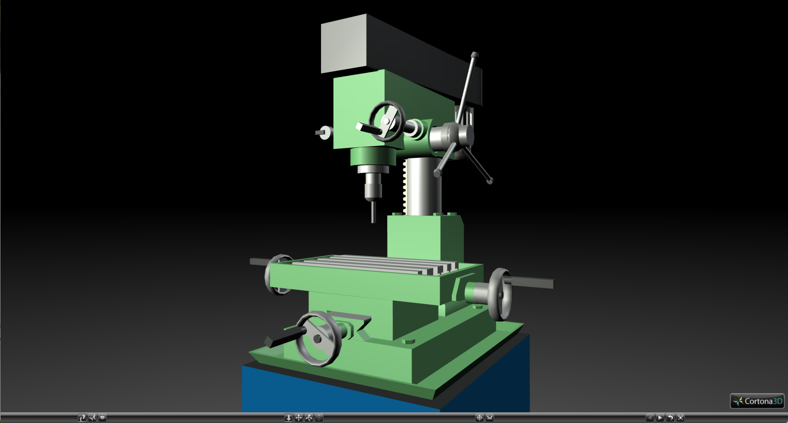
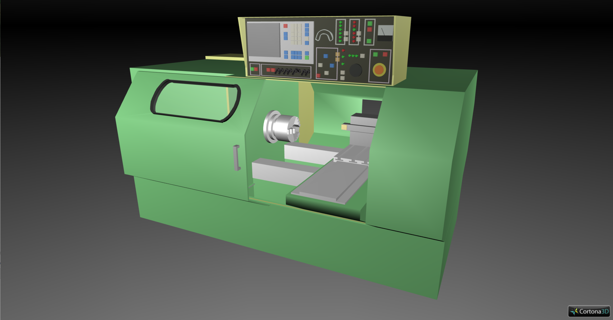
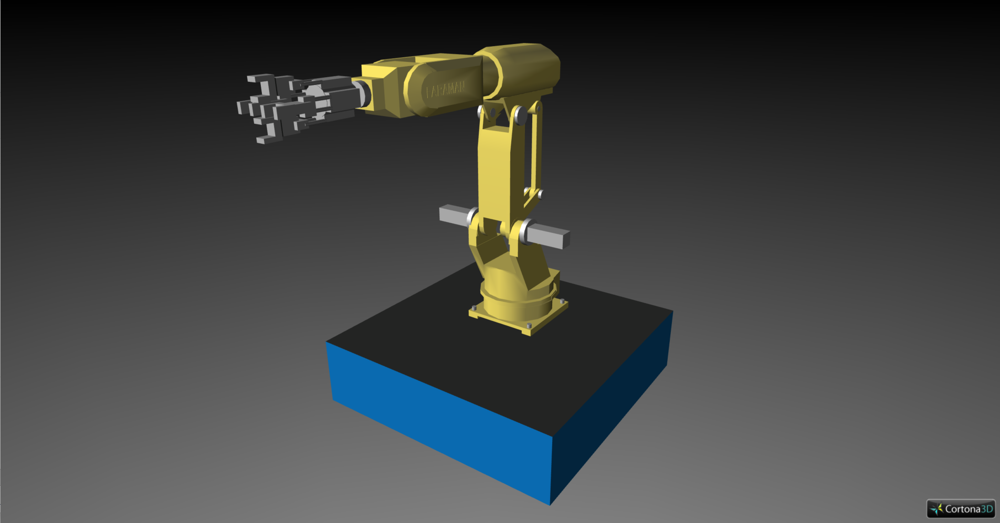
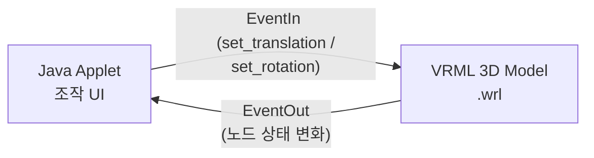

<!-- Java-VRML 연동 예제 소스코드 사용 방법 가이드 -->
# Java-VRML 연동 예제 소스코드 사용 방법 가이드

본 문서는 `src` 디렉토리 내에 포함된 Java Applet 및 VRML 연동 예제들의 구조, 작동 원리 및 실행 방법을 설명합니다.

---

## 1. 예제 프로젝트 개요 및 폴더 구성

`src` 폴더 내부에는 3D VRML 모델과 Java Applet을 연동하여 장비를 제어하는 3가지 시뮬레이션 예제가 포함되어 있습니다.

### ① [drill-exam](/src/drill-exam) (드릴 머신 시뮬레이터)

웹 화면의 스크롤바 조작을 통해 3차원 공간 상의 드릴 머신(Drilling Machine)을 제어하고, 드릴이 완전히 내려갔을 때 작동 음향을 재생하는 예제입니다.

* [Drill.java](/src/drill-exam/Drill.java): 스크롤바 조작에 따라 드릴 척(Chuck)의 하강 및 회전, 가공 테이블의 이동을 처리하는 애플릿 소스코드.
* [Drill_jar.jar](/src/drill-exam/Drill_jar.jar) / `Drill.class`: 컴파일된 자바 클래스 및 아카이브 파일.
* [Drill.wrl](/src/drill-exam/Drill.wrl): 드릴 머신의 3D 형상 정보 및 움직이는 관절 부위가 정의된 VRML 모델 파일.
* [Drill_Jar.html](/src/drill-exam/Drill_Jar.html): 웹 브라우저상에서 VRML 모델(`.wrl`)과 애플릿(`.class`)을 한 화면에 임베딩하는 HTML 파일.
* `drill.au`: 드릴 가공이 완료(스크롤바 최대값 도달)되었을 때 재생되는 가공음 사운드 파일.
* `drillbg.jpg`: 애플릿 제어판의 배경 이미지 파일.


### ② [nc_exam](/src/nc_exam) (NC 가공기 시뮬레이터)

스크롤바를 통해 공작기계(Numerical Control Machine)의 바이트(Bite, 칼날)와 공작물이 고정되는 테이블(Table)을 축 방향으로 평행 이동 제어하는 예제입니다.

* [NC.java](/src/nc_exam/NC.java): 바이트 가공축 및 테이블 이송축의 위치를 조작하는 애플릿 소스코드.
* [nc.wrl](/src/nc_exam/nc.wrl): NC 가공기 본체, 바이트, 테이블 구조가 설계된 VRML 모델 파일.
* [NCmachine.html](/src/nc_exam/NCmachine.html): VRML 뷰어 영역과 조작용 자바 애플릿 영역을 결합한 HTML 파일.
* `ncbg.jpg`: 애플릿 제어판의 배경 이미지 파일.


### ③ [robot_exam](/src/robot_exam) (6축 로봇 팔 & 티칭 펜던트)

실제 산업용 로봇 조작에 쓰이는 '티칭 펜던트(Teaching Pendant)' 인터페이스를 자바 UI로 구현하여, 6자유도 로봇 팔(Robot Arm)의 각 관절축(1축 ~ 6축)을 사용자가 지정한 각도 및 방향(+/-)으로 회전 제어하는 예제입니다.

* [Pendant.java](/src/robot_exam/Pendant.java): 티칭 펜던트 버튼 입력(0~9, 소수점), 클리어(Clear), 홈 위치(Home position) 기능 및 각 축 회전 연산 로직이 담긴 애플릿 소스코드.
* [robot.wrl](/src/robot_exam/robot.wrl): 관절별 계층 구조(Parent12 ~ Axis6)로 이루어진 6축 로봇 팔 VRML 모델 파일.
* [Pendant1.html](/src/robot_exam/Pendant1.html): 로봇 3D 뷰어 영역과 티칭 펜던트 인터페이스를 담은 HTML 파일.


---

## 2. 작동 원리 (Java-VRML EAI 연동)

이 예제들은 **EAI (External Authoring Interface)** 표준 API를 활용하여 Java 애플릿과 VRML 뷰어 간에 데이터를 양방향 통신합니다.



1. **노드 매핑 (Node Retrieval)**:
    자바 애플릿은 브라우저 인스턴스를 통해 VRML 씬(Scene)의 노드 객체를 획득합니다.

    ```java
    Browser browser = Browser.getBrowser(this);
    Node chuckNode = browser.getNode("Chuck"); // VRML 내 DEF Chuck으로 선언된 노드 검색
    ```

2. **이벤트 전달 (EventIn/EventOut)**:
    조작하려는 속성(예: translation, rotation)의 EventIn 통로를 변수로 받아 캐스팅합니다.

    ```java
    EventInSFVec3f chuckEvtOut = (EventInSFVec3f) chuckNode.getEventIn("set_translation");
    ```

3. **동적 제어 (Dynamic Control)**:
    사용자가 자바 UI(스크롤바, 버튼)를 움직이면 이벤트를 감지하여 계산된 좌표(SFVec3f)나 회전값(SFRotation)을 VRML 노드에 실시간 전송합니다.

    ```java
    float chuckTranslation[] = { 0.0f, -0.5f, 0.0f };
    chuckEvtOut.setValue(chuckTranslation); // 3D 상의 드릴 척이 아래로 이동
    ```

---

## 3. 개발 및 컴파일 방법

자바 애플릿 코드(`*.java`)를 수정하거나 다시 빌드하려면 아래 패키지와 환경이 필요합니다.

### 요구 사항

* **JDK 8 이하 버전** (JDK 1.8.x 권장)
  * *주의: JDK 9 이상부터는 Applet 기술이 Deprecated 되었으며, 최신 JDK 버전에서는 컴파일 및 실행이 불가능합니다.*
* **VRML EAI 라이브러리 JAR**:
  * `vrml.external.*` 클래스 라이브러리가 필요합니다.
  * 통상적으로 사용 중인 VRML 웹 플러그인(예: Cortona3D, Cosmo Player) 설치 경로 또는 옛 웹 브라우저 디렉토리 내에 제공되는 `vrml.jar`, `npcosmop.jar` 등의 파일을 Classpath에 지정해야 합니다.

### 컴파일 예시 (PowerShell)

```powershell
# EAI 라이브러리(vrml.jar) 경로를 포함하여 컴파일 진행
javac -classpath ".;C:\Program Files\Common Files\vrml.jar" src\drill-exam\Drill.java
```

---

## 4. 구동 및 실행 방법

현대 웹 브라우저(Chrome, Edge 등)는 보안 취약점으로 인해 **Java 플러그인(NPAPI)** 및 **VRML 뷰어 플러그인** 실행을 완전히 차단하고 있어 단순 더블 클릭으로는 실행되지 않습니다. 따라서 아래 오프라인 실행 도구를 이용해야 합니다.

### 방법 1: JDK `appletviewer` 사용 (가장 간편한 방법)

JDK 8 이하 버전이 로컬에 설치되어 있는 경우, 명령 프롬프트나 PowerShell에서 `appletviewer` 도구를 활용하여 실행할 수 있습니다.

1. 경로 내 HTML 파일이 있는 위치로 터미널을 열고 다음 명령어를 실행합니다.

    ```powershell
    # 예제별 실행 명령어
    appletviewer src\drill-exam\Drill_Jar.html
    appletviewer src\nc_exam\NCmachine.html
    appletviewer src\robot_exam\Pendant1.html
    ```

2. *참고: PC 환경에 VRML 웹 컴포넌트(Cortona3D Viewer 등)가 설치되어 있고 EAI가 지원되도록 설정되어 있어야 3D 뷰어 창이 정상적으로 로드됩니다.*

### 방법 2: 구형 브라우저 가상화 (Internet Explorer 호환 모드)

과거 환경을 재현해야 하는 경우, IE Tab 크롬 확장 프로그램이나 가상 머신(Windows XP 등 구형 OS) 환경을 사용하여 연동 테스트를 진행할 수 있습니다.

* **필요 플러그인**:
  * [Cortona3D Viewer](https://www.cortona3d.com/en/downloads) 혹은 [Cosmo Player](http://www.karmanaut.com/cosmo/player/) (VRML 뷰어)
  * Java Runtime Environment (JRE) 8 이하 버전
