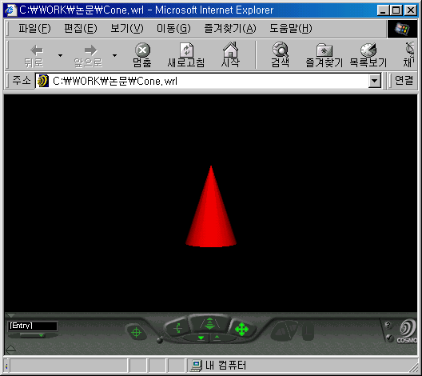
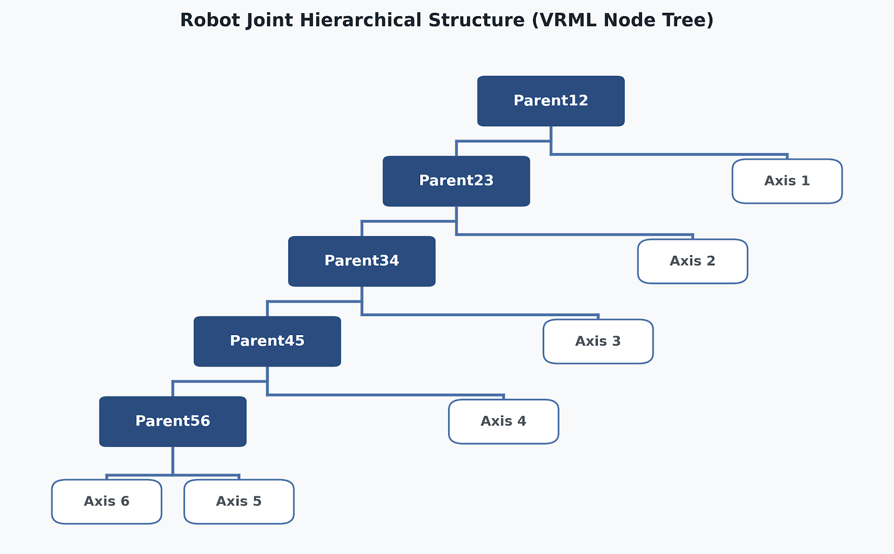

# 인터넷을 이용한 Remote navigation 및 Remote control이 가능한 3차원 가상공간 구축

* **작성:** 1998.12

---

## 차례

* [머리말](#머리말)
* [Abstract](#abstract)
* [1. VRML](#1-vrml)
  * [1.1 소개](#11-소개)
  * [1.2 역사](#12-역사)
  * [1.3 VRML 브라우저](#13-vrml-브라우저)
  * [1.4 저작툴](#14-저작툴)
  * [1.5 VRML 문법](#15-vrml-문법)
* [2. 자바](#2-자바)
  * [2.1 객체지향 프로그래밍](#21-객체지향-프로그래밍)
  * [2.2 자바](#22-자바)
  * [2.3 EAI(External Authoring Interface)](#23-eaiexternal-authoring-interface)
* [3. 결론](#3-결론)
* [부록 A.1 VRML 브라우저 비교](#부록-a1-vrml-브라우저-비교)
* [부록 A.2 저작툴 비교](#부록-a2-저작툴-비교)
* [부록 A.3 VRML 필드타입](#부록-a3-vrml-필드타입)
* [부록 B 참고 문헌 및 관련 사이트](#부록-b-참고-문헌-및-관련-사이트)

---

## 머리말

"Network of network"라는 인터넷이 발전하면서 이를 이용해 상업적으로도 크게 성공한 사례들이 나오는데 대표적으로 검색엔진 "Yahoo"나 온라인 서점 "Amazon" 등이 그것들입니다. 뿐만 아니라 인터넷은 기술적으로도 많은 진보를 가져오게 하였습니다.

그 중 하나가 바로 선 마이크로시스템즈사에서 개발한 객체지향언어 **자바(Java)**이고, 다른 하나는 비영리단체인 VRML 컨소시움에서 정한 가상현실모델링언어인 **VRML**입니다.

언제나 새로운 것에 열광하고 소프트웨어 업계에서 독점적 지위를 영위하는 마이크로소프트사에 반감을 가진 많은 젊은 네티즌들과 프로그래머들의 호응에 힘입어, 자바는 개인 홈페이지를 폼나게 장식하는 액세서리에서부터 OS에 이르기까지 많은 분야에서 기존의 객체지향언어들의 영역을 잠식해나가고 있으며, C++보다 진일보된 객체지향언어라는 점에서 앞으로 자바가 더욱 각광을 받으리라는 것은 의심할 여지가 없을 것입니다.

한편으로 VRML 역시 꾸준하게 여러 상업적 분야와의 접목을 시도해왔고, 무엇보다 2차원적인 기존의 인터넷 인터페이스에 3차원이라는 개념을 도입함으로써 그 발전 가능성과 활용도에 있어 점차로 주목받기 시작하는 분야입니다.

이렇듯 앞으로도 인터넷을 주도하게 될 두 신기술의 접목은 가히 환상적이라 할 수 있을 것입니다. VRML이 가지는 취약한 사용자 인터페이스 부분이나 프로그래밍적인 면을 자바가 보완해주고, 자바 역시 또 다른 분야로의 확장성을 보임으로써 다시 한번 그 가능성을 인정받게 되는 것입니다.

---

## Abstract

VRML은 현실에 존재하는 객체를 가상적으로 컴퓨터 상에 구현, 동작시켜 봄으로써 실제와 유사한 가상체험을 할 수 있습니다.

본 작품에서는 이런 VRML의 특징을 활용해 로봇을 비롯 각종 공작기계들을 모델링하고 가상적으로 동작시켜 볼 수 있도록 했습니다.

그러나 VRML이 본래 3차원 장면(Scene)을 구성하도록 디자인되었기 때문에 가상 객체를 동작시키는 부분에 있어서는 VRML 만으로는 미흡한 면이 있습니다. 이에 따라 자바와 연결하여 사용자 인터페이스를 만들고, 마우스의 이벤트에 따라 가상 객체가 동작할 수 있도록 VRML에 동작 메시지를 전달하게끔 설계하였습니다.

---

## 1. VRML

### 1.1 소개

#### 목적

Virtual Reality Modeling Language (VRML)은 상호대화적인 3D 오브젝트와 세상을 표현하기 위한 파일 포맷으로 인터넷, 인트라넷과 로컬 클라이언트 시스템에 사용하기 위해 설계되었습니다. 또한 3D 그래픽과 멀티미디어의 통합을 위해 범용적인 호환 포맷이 될 수 있습니다. 활용범위에 있어서는 공학과 과학에서의 시각적 표현, 멀티미디어 프리젠테이션, 오락과 교육목적, 웹 페이지 그리고 가상세계를 만드는 데 사용할 수 있습니다.

#### 설계 범주

VRML은 다음과 같은 요구를 만족시킬 수 있도록 설계되었습니다.

* **제작이 용이하게 (저작성):** 공통으로 사용되는 다른 3D 파일 포맷을 VRML 파일로 변환하기 위한 자동변환 프로그램뿐 아니라 VRML 파일을 만들고 편집하고 유지할 수 있는 컴퓨터 프로그램의 개발을 가능케 합니다.
* **구성이 쉽도록 (조직성):** VRML 세계 내에서 동적인 3D 오브젝트를 사용하고 조합할 수 있는 능력뿐 아니라 재사용이 가능토록 합니다.
* **확장이 가능하도록 (확장성):** VRML에서 명확히 정의되지 않은 새로운 오브젝트 형태도 추가할 수 있도록 합니다.
* **수행능력:** 다양한 시스템에서 수행이 가능하도록 합니다.
* **성능:** 다양한 컴퓨팅 플랫폼에서의 최대한의 성능을 발휘하도록 합니다.
* **무한한 가능성:** 임의적인 3D 세계를 가능하게 합니다.

#### VRML의 특징들

VRML은 텍스트, 사운드, 무비와 이미지와 같은 다른 미디어와의 하이퍼링크된 멀티미디어와 정적이고 움직이는 동적 3D를 표현할 수 있습니다. VRML 파일을 만들기 위한 저작도구뿐 아니라 VRML 브라우저는 많은 다양한 플랫폼에서 이용할 수 있습니다.

VRML은 허가된 응용업계에서 기본 표준에 따라 상호 운용가능한 확장형을 개발해 정의한 새로운 동적 3D 오브젝트를 가능하도록 한 확장 모델을 지원합니다. 이것은 VRML 오브젝트와 공통적으로 사용되는 3D 응용프로그래밍 인터페이스(API) 특징들 사이에서 쓰입니다.

---

### 1.2 역사

1994년 유럽 웹 컨퍼런스에서 팀 버너스 리가 3차원 웹표준의 필요성에 대해 주장한 것이 사실상 VRML의 시초입니다. 그는 HTML과 유사한 개념의 VRML(Virtual Reality Markup Language)이라는 단어를 만들었습니다. 마크 펫스라는 사람은 이러한 아이디어를 바탕으로 브리안 베홀렌도프의 Wired 잡지에 VRML 메일링 리스트 개념을 사용하기 시작했습니다.

VRML 메일링 리스트는 사회적으로 예술, 공학 그리고 공상과학의 성장으로 인한 열매에 해당합니다. 그리고 페이지상의 문서에서 어떤 세계를 반영한다는 Virtual Reality Modeling Language 라는 이름으로 바뀌었습니다. 이 그룹은 전자우편으로 상호연결되는 VRML 1 설명서를 만들었습니다. 이것은 표준적인 파일 개발의 기본적인 생각을 실리콘 그래픽스사에 제공했습니다. 개발자는 표준적 파일을 완성시키기 위해 TV 방송이나 영화의 애니메이션을 다루는 대학이나 연구소로부터 영향을 받았습니다. 개발자 중 어떤 파트는 쉽게 실행되는 전역변수 플랫폼을 선택했습니다. 비록 몇 개의 VRML 브라우저가 만들어졌지만, 이것들은 어떠한 범위의 언어 내에서만 작동되는 불완전한 기능을 수행했습니다. 개발자의 상호진보나 애니메이션의 능력을 포함하지 못했습니다. 따라서 VRML 1 설명서의 잉크가 채 마르기도 전에 새로운 가상세계의 표현을 위한 작업이 수행되었습니다.

VRML 1의 개선으로 VRML 1.1이 시도되었습니다. VRML 1.1은 소리와 애니메이션의 능력을 조심스럽게 더했습니다. 하지만 VRML 1의 테두리 안에서의 개선이었기 때문에 많은 이들의 외면과 자체의 한계로 빛도 못 본 채 사라져갔습니다. 후에 VRML 언어에 대한 정밀한 검증 작업 후에 나온 것이 바로 VRML 2입니다.

1995년 가을, VRML 협회에 다년간 새로운 아이디어를 기고한 사람 중의 하나인 마크 펫스는 VRML 2의 방향을 VAG(VRML Architecture Group)으로 이끌었습니다. VAG의 목표는 VRML 2의 스펙을 정의하는 것이었습니다. 그것은 곧 많은 디자인을 수행하는 그룹이 재미있는 일로 지향하는 것과 마지막 설명서를 인정하는 것이었습니다. 이 그룹은 벨의 VRML 2의 세 번째 기술을 기본으로 재빨리 요구 리스트를 발전시켰습니다. 회사나 학회, 그리고 개인이 받아들일 수 있는 제안을 한 것도 이 시기에 결정된 일이었습니다. 이러한 제안은 VRML 협회의 토론과 투표로 단일안을 만들어 VRML 2의 스펙을 결정했습니다.

제안은 SGI, SONY, Sun, MS 등 많은 회사나 학회가 준비했습니다. 이 과정에서 SGI는 SONY와 함께 제안 내용에 많은 영향력을 발휘하기 위해 연합을 형성하고 이를 '무빙월드'라 불렀습니다. 몇몇 제안과 요구사항은 VRML 1을 기초로 세워졌습니다. 이것이 진전됨에 따라 무빙월드는 가장 완성도 높은 제안으로 여겨졌습니다. 그러나 마이크로소프트사는 전체적이고 새로운 Active VRML이라는 방향을 제시하여 경쟁적 위치에 서게 되었습니다.

이 경쟁은 VRML의 메일링 리스트 상에서 발생하였습니다. 기술적인 면에서나 정치적인 면에서나 이 두 개의 이슈는 서로 경쟁을 벌였습니다. 절차를 밟는 과정 중에 두 가지의 문제가 제기되었습니다. 응답자에게 VRML 2에 대한 각 제안의 필요성의 비율이 적합한 부분에서부터 적합하지 않은 부분까지 질문할 수 있었습니다. 그래서 각각의 응답자에게 선호하는 것을 지목하도록 요구되었습니다. 결국 무빙월드는 92퍼센트의 적합성을 지니게 되었고, 그들의 선호도에 따라 응답자의 74퍼센트가 그것을 지지했습니다. 이런 이유 때문에 마크 펫스는 하나의 일치점으로 종종 거론할 수 있었으며, VAG가 VRML 2의 기초로써 무빙월드를 선택할 수 있었던 것입니다.

그러나 이 작업이 결코 끝난 것은 아닙니다. 벨, 리키 커레이, 그리고 펫스는 VRML 2 설명서의 초안 단계 디자인을 통해 어느 정도 완성된 VRML 2의 기준을 제시할 책임이 있었습니다. 그러나 이러한 일이 발생되기 전에는 끊임없는 수정 작업과 구체화가 이루어져야 하며, 그 결과는 가상세계가 실생활의 문제를 해결할 수 있는지 검증 작업이 이루어져야 했습니다. VRML 메일링 리스트의 구현에 공헌한 사람들은 많은 논의를 했으며, 내부적 통합을 위해 노력했습니다. 결국 VRML 2는 협회의 공동 작품인 것입니다.

VRML 2가 만들어짐에 있어서의 일련의 과정과 노력들은 ISO의 커다란 관심을 불러일으켰습니다. 1996년 6월, 커레이는 VRML 2를 ISO의 표준으로 만들기 위해 일본으로 갔습니다. ISO 위원회는 최초의 VRML 협회의 성과를 인정했으며, 그 설명서를 정식 과정으로 채택했습니다. 게다가 그 위원회는 현재 VRML을 통해 기존의 낙후된 ISO 표준절차를 업그레이드시키려 하고 있습니다.

수개월 동안의 작업을 마치고 Siggraph 96(3차원 그래픽 기술을 선도하는 모임)에서 VRML 2의 설명서를 발표했습니다. 커레이는 아직 VRML 2가 끝나지 않았고 계속 연구되고 있다고 말합니다. 이 발표는 커레이 개인의 생각과 협회에 대한 바램이 담겨있는데, 설명서는 앞으로의 진보라기보다는 현재 가지고 있는 내용을 충실히 표현하고자 하는 데 있다고 할 수 있습니다.

---

### 1.3 VRML 브라우저

VRML로 만들어진 가상세계를 보기 위해서는 VRML 브라우저가 필요합니다. 현재 가장 널리 보급되어 있는 것은 Cosmosoftware사의 Cosmo Player(이하 CP)입니다. 대부분의 브라우저가 그렇듯이 CP 역시 무료로 배포되고 있고 유일하게 VRML와 자바가 연동할 수 있도록 하는 API를 제공하는 브라우저이기도 합니다. 본 작품에서는 CP 2.1 버전으로 테스트하였으며 2.0 버전이라도 무난히 동작합니다.

현재 넷스케이프 네비게이터(이하 NS) 4.04 버전까지는 CP 1.0이 플러그-인 되어있으며, 4.05버전부터는 CP 2.0버전이 플러그-인 되어있습니다. 그러나 마이크로 소프트 인터넷 익스플로러(이하 IE)는 플러그-인 기술 미비로 CP를 사용하려면 별도로 다운을 받아 설치를 해주어야 합니다. NS의 버전이 4.05 미만이라 하더라도 CP 2.0을 설치하면 NS에서도 CP 2.0을 사용할 수 있습니다. 그러나 최근 NS의 버전이 올라가면서는 CP를 플러그-인 하고 있지 않아 4.06 이상 버전의 NS에서도 마찬가지로 별도 설치를 해주어야 합니다.

이 외에도 많은 VRML 브라우저들이 공개 또는 셰어웨어 형태로 인터넷에서 배포되고 있습니다. (자세한 내용은 [부록 A.1 VRML 브라우저 비교](#부록-a1-vrml-브라우저-비교) 참조)

---

### 1.4 저작툴

VRML 2.0 스펙에 맞추어 가상세계를 만들 수 있는 각종 저작툴들이 많이 상용화되어 있습니다. 이러한 툴들은 VRML 세계를 손쉽게 만들 수 있다는 것과 장면의 레이아웃이 복잡할 경우 VRML 오브젝트들을 보다 쉽게 배치할 수 있다는 장점이 있으나 필요 이상으로 파일 크기가 커진다는 단점도 있습니다.

이러한 점은 저속의 모뎀 등을 이용해 VRML 세계에 접속하는 대다수 이용자들에게 다운로딩하는 데 많은 시간을 할애하게 함으로써 오히려 접속을 회피하게 하는 장애요소로 작용할 수 있습니다. 이런 점을 염두에 두고 저작툴에만 의존하기보다는 VRML 스펙을 숙지해 저작툴을 이용해 만들어진 확장자 `.wrl` (World) 파일의 소스를 최적화시킬 수 있는 능력을 갖는 것도 중요합니다.

또한 부록에서 소개하는 툴들의 기능이나 역할이 비슷한 경우도 많이 있으나 만들고자 하는 세계에 따라 그에 적합한 툴들이 있습니다. 꼭 어느 한 툴을 고집하기보다는 제각기 장단점을 비교해 경우에 맞게 사용하는 것도 현명한 방법입니다. 그러나 대부분 셰어웨어 버전으로 배포가 되기 때문에 간혹 애써 만든 세계를 저장할 수 없는 경우도 있으므로 주의해야 합니다.

본 작품에서는 3D 모델링/렌더링 툴인 Caligari사의 trueSpace를 사용했는데 초보자가 사용하기에도 무리가 없으며 객체를 모델링하는 데도 용이하고, 빠른 렌더링 속도를 자랑하므로 모델링 즉시 결과물을 실제와 비교해 볼 수 있는 장점이 있습니다. 그러나 VRML 전용 저작툴은 아니기 때문에 2.0 규약의 VRML 파일로 export 하는 기능을 가지고 있지만, import는 1.0 규약의 파일만이 가능합니다.

이 때문에 앞서 언급한 바와 같이 한 가지 툴만 사용하지 않고 Cosmosoftware사의 Cosmo Worlds 2.0 툴을 병행하여 사용하였습니다. Cosmo Worlds의 경우에는 VRML 2.0 규약에 충실히 맞추어 제작된 VRML 전용 툴이기 때문에 무엇보다 VRML 파일로의 변환과 불러오기가 자유롭고, 직관적인 인터페이스로 VRML 문법을 몰라도 숙련된 컴퓨터 사용자라면 쉽게 사용할 수 있는 장점이 있습니다. 그렇기 때문에 trueSpace로 작업하여 VRML 파일로 변환한 후에는 코스모 월즈에서 다시 불러와 여러 객체들을 재배치하는 등의 마무리 작업에 사용하였습니다.

또 Cosmo Worlds의 다른 장점 중의 하나는 유닉스 압축인 gzip으로의 압축 기능입니다. trueSpace로 작업하여 변환한 VRML 파일은 모델링을 세부적으로 할 경우 몇 MB에 달하는 경우가 발생하는데 이런 것을 일반 모뎀 사용자가 접속하여 다운로딩한다는 것은 다소 무리가 있습니다. VRML 파일이 ASCII 파일의 형태로 되어 있기 때문에 gzip으로 압축할 경우 최대 1/10까지 압축이 가능합니다. 그래서 이를 gzip의 압축형태로 압축하여 서버에 탑재한 후 사용자가 다운로드 받으면 사용자의 컴퓨터상에서 VRML 브라우저가 압축을 풀어 VRML 세계를 보여주게 됩니다. 이는 제작자나 사용자나 모두에게 상당히 합리적인 방법이라 할 수 있습니다. (자세한 내용은 [부록 A.2 저작툴 비교](#부록-a2-저작툴-비교) 참조)

---

### 1.5 VRML 문법

VRML은 'Language'라는 단어가 갖는 일반적인 통념과는 달리 컴파일되지 않고 ASCII 파일 형태 그대로 사용자 컴퓨터로 다운로딩된 후 VRML 브라우저에 의해 해석(Parsing)됩니다. 따라서 VRML은 일반 텍스트 에디터를 통해 작성이 가능하며, 저작툴을 통해 만들어진 VRML 파일 역시 텍스트 에디터를 통해 편집이 가능합니다.

VRML에서 가상세계를 구축하는 것을 **장면(Scene)**을 만든다고 합니다. 장면을 구성하는 것은 **노드(Node)**이고 several 노드가 모여 하나의 객체를 구성하게 됩니다. 이런 노드들은 장면 그래프(Graph)라고 하는 계층적 구조 속에서 조정됩니다. 장면 그래프가 노드를 위한 순서를 정의하는 것입니다. 따라서 장면의 앞에 있는 노드가 뒤에 나타나는 노드에 영향을 미칠 수도 있습니다. 예를 들어, Rotation이나 Material 노드는 장면 내에서 다음에 나오는 노드에 영향을 주게 됩니다.

VRML에는 60개의 노드 타입이 있으며 노드와 노드를 이었을 때 이를 그룹핑 노드(Grouping node)라고 하고, 위쪽의 노드를 부모 노드(Parent node), 아래쪽 노드를 자식 노드(Child node)라고 합니다. 노드들이 어떤 기능을 수행하는 부분이라고 한다면 각각의 노드에는 일련의 필드(Field)를 포함하며 이것은 기능적 요소 값을 가집니다.

#### Cone 노드 예시

```vrml
Cone {
    field SFFloat bottomRadius 1
    field SFFloat height       2
    field SFBool  side         TRUE
    field SFBool  bottom       TRUE
}
```

위의 Cone 노드는 4개의 필드로 되어있고 각각의 필드는 초기값을 가집니다. 또 필드는 그 성격에 맞는 타입으로 정의가 되어있습니다. VRML에서 규격을 나타내는 모든 숫자는 미터 단위를 사용하며 위의 필드에서 `bottomRadius`와 `height`는 각각 1미터와 2미터를 나타냅니다. 또한 `SFBool` 타입으로 지정된 `side`와 `bottom`은 TRUE일 때 보이고 FALSE일 때는 보이지 않는 것을 의미합니다. 이 외에도 VRML의 필드타입은 총 18가지가 있습니다. (자세한 내용은 [부록 A.3 VRML 필드타입](#부록-a3-vrml-필드타입) 참조)

앞서 나온 Cone 노드를 가지고 실제로 VRML 장면을 구성해 보면 다음과 같습니다.

```vrml
#VRML V2.0 utf8
Shape {
    appearance Appearance {
        material Material {
            diffuseColor 1 0 0
        }
    }
    geometry Cone { height 3 }
}
```

제일 첫 줄은 주석문이지만 반드시 포함시켜야 하는 구문입니다. 이 줄은 어떤 플랫폼에서 작성된 VRML 파일이라 할지라도 역시 플랫폼에 상관없이 읽혀질 수 있도록 유니코드 포맷(UTF: UniCode Text Format)으로 정의하는 부분이기 때문입니다.



Shape 노드는 `appearance`와 `geometry` 필드를 가지고 있으며, 각각은 다시 Appearance와 Cone 노드를 포함하고 있습니다. 이런 식으로 Appearance 노드는 `material` 필드를 가지고 다시 Material 노드는 `diffuseColor` 필드를 가집니다. Material 노드의 `diffuseColor` 값은 Red 값만 1로 되어 있어 실행하면 적색의 Cone이 나타납니다.

---

## 2. 자바

### 2.1 객체지향 프로그래밍

OOP(Object-Oriented Programming)는 객체 지향 프로그래밍이라는 말로 표현됩니다. 70년대 초에 개발된 절차기반(Procedure-based) 프로그래밍 언어를 대체하는 새로운 프로그래밍 패러다임(Paradigm)입니다. C, BASIC, PASCAL 등에서의 함수 역할을 OOP에서는 객체가 대신합니다. 이러한 객체를 마치 레고 블록을 조립하듯 조립해 원하는 모양을 갖춘 프로그램을 만들게 됩니다.

* **상속 (Inheritance):** 클래스는 일종의 템플릿(Template)이라고 볼 수 있습니다. 하나의 클래스로부터 계속해서 같은 클래스를 만들어내거나 또는 다른 클래스로 변형을 할 수도 있습니다. 이처럼 원래의 클래스(Super class)로부터 만들어낸 클래(Sub class)는 수퍼 클래스의 모든 특성과 기능들을 그대로 가지게 됩니다. 물론 새롭게 기능을 추가하거나 삭제할 수도 있습니다. 이처럼 수퍼 클래스로부터 서브 클래스를 만들어내는 것을 상속이라고 합니다.
* **캡슐화 (Encapsulation):** 캡슐화는 사용자로부터 객체 내부의 데이터를 감추는 것입니다. 데이터를 변수로 나타내며, 클래스의 함수와 프로시저는 메소드(Method)라고 합니다. 클래스가 다른 클래스의 데이터를 다루려면 메소드를 통해야 합니다. 이러한 캡슐화는 객체 내부의 처리과정을 알 필요 없이 그것을 다루는 메소드에 대해서만 알면 된다는 점에서 편리합니다. C에서 `printf()`를 사용할 때 `printf()`의 내부에 대해서는 볼 수 없고 단지 화면에 문자를 출력할 때 사용하는 것과 같습니다.
* **다형성 (Polymorphism):** 수퍼 클래스로부터 상속받은 여러 개의 서브 클래스가 있을 때, 이들 서브 클래스는 수퍼 클래스의 메소드를 이용할 수 있습니다. 이럴 경우 파라미터(Parameter)를 갖는 메소드의 호출이 일어났을 때(이벤트가 발생했다고 한다) 이것을 어떻게 처리할 것인가? 이벤트가 발생하면 각 서브 클래스(객체)들에 이벤트를 처리하라는 메시지가 보내지고 해당 객체들은 자신의 메소드인지를 판단하여 실행하고 그렇지 않을 경우 수퍼 클래스로 이동하여 해당 메소드를 호출합니다. 이런 식으로 해당 메소드를 찾을 때까지 상속된 계층을 따라 메시지가 전달됩니다. 이처럼 상속계층상에서 어떤 객체의 어느 메소드를 호출할 것인지를 결정하는 객체의 능력을 다형성이라고 합니다. 이 때문에 다형성 함수는 전달하는 변수의 타입을 고려하지 않게 됩니다. 예를 들어 사인곡선을 그리는 함수가 있다고 할 때 사용자는 파라미터로 radian이나 degree 값을 넣게 되지만 둘 다 처리할 수 있습니다. 이것은 `Sine(int degrees)`나 `Sine(float Radians)`와 같이 동일 이름의 함수가 다른 파라미터로 두 번 선언되었기 때문입니다.

---

### 2.2 자바

자바는 썬 마이크로시스템즈사(Sun Microsystems Inc.)의 제임스 고슬링(James Gosling)과 그의 팀이 전자제품을 제어하기 위한 언어로 만들었으나 큰 성과를 얻지 못한 채 사장될 뻔하다가, WWW이 발전하면서 새롭게 부각되기 시작했습니다. 자바는 완전한 객체지향이며 C++을 기초로 했지만 C++의 군더더기를 없애고 슬림화시켰기 때문에 배우고 사용하기가 훨씬 쉽습니다. 이 새로운 툴은 인터넷상에서 작업하기 위한 중요한 언어로 빠르게 개발되고 있습니다.

#### JAVA가 좋은 이유?

자바로 만들어진 프로그램은 '윈도우즈용', '맥킨토시용' 구분이 따로 없습니다. 자바는 이처럼 **플랫폼 독립적(정확히는 플랫폼 중립적)**이기 때문에, 특정 플랫폼(윈도우즈나 유닉스 등)에서 만들어진 자바 프로그램이라도 별도의 수정 작업 없이 서로 다른 시스템에서 실행이 가능하다는 것입니다. 이 때문에 인터넷용 프로그래밍 언어로 각광받고 있는 것입니다.

자바의 경우, PC, 맥킨토시, 유닉스 등에서 만들어진 소스코드는 각 컴파일러를 거쳐 중간코드인 **바이트 코드**로 만들어지고, 이는 다시 각각의 플랫폼용으로 만들어진 **자바 가상머신(JVM: Java Virtual Machine)**에서 실행(해석)됩니다. 결국 한번 만들어진 플랫폼 중립적인 자바 바이트 코드는 어느 플랫폼에서건 다시 수정, 배포하는 번거로움 없이 실행시킬 수 있는 것입니다.
*(※ JAVA 가상머신은 소프트웨어적으로 구현된 자바 프로세서입니다.)*

#### JAVA와 VRML

자바가 기존의 정적인 웹페이지에 상호대화적인 기능을 부여한다면, VRML은 2차원적인 웹페이지를 현실세계와 같은 3차원으로 만드는 기술입니다. 이런 두 가지의 장점을 취하면 3차원적이면서도 상호대화적인 웹페이지를 만드는 것이 가능하게 됩니다.

VRML에서 EAI(External Authoring Interface)라고 하는 외부환경과의 의사전달 통로를 이용해 자바를 사용합니다. 외부환경과의 연결을 위해 꼭 자바를 사용할 필요는 없겠으나, 보다 유연하고 확장 가능하며 고차원적인 가상세계의 구축을 위해서라면 자바를 사용하는 것이 가장 적합할 것입니다.

#### 객체지향과 JAVA

자바 역시 OOP 언어이기 때문에 객체지향 프로그래밍은 데이터와 데이터 간의 인터페이스 설계에 초점을 맞춥니다. 목수를 예로 들면 객체지향에서는 만들고자 하는 것(목적물)에 주관심을 가지고 도구와 같은 것은 부차적인 것이 되지만, 기존의 비객체지향에서는 목수가 도구에 주관심을 두고 작업을 진행하게 됩니다. 실생활에서의 객체는 우리 주변의 모든 물리적인 것들이 될 수 있습니다. 객체를 프로그래밍적으로 나타내려면 **클래스(Class)**로 표현합니다.

```java
class 클래스명 [extends 클래스명] [implements 인터페이스] {
    // 변수 선언;
    // 메소드 선언;
}
```

#### 클래스 선언 예시 (Wheel)

```java
class Wheel {
    int center, max_speed;
    float radius, width;

    void Roll(int speed) {
        boolean clockwise, counter_clockwise;   
        max_speed = speed;
        // ... 생략 ...
    }
}  

// 객체의 인스턴스화 (생성)
Wheel Flying_wheel;
Flying_wheel = new Wheel();

// 객체의 멤버 데이터와 메소드에 접근
Flying_wheel.max_speed = 180;
Flying_wheel.Roll(70); 
```

위의 소스코드는 바퀴라는 물리적인 객체를 자바 클래스로 정의한 것입니다. Wheel이라는 물리적 객체는 프로그래밍적으로 중심좌표, 폭, 반경만 있으면 만들 수 있고 굴리는 동작(`Roll`)을 수행할 수 있습니다. 클래스를 정의할 때 이러한 값들을 변수와 메소드로 구현하여 제어하게 됩니다.

```java
class Flying_wheel extends Wheel {
    // ... 수퍼 클래스 Wheel을 상속받아 세부 구현 ...
}      
```

이런 식으로 `Flying_wheel` 클래스의 수퍼 클래스는 `Wheel`이 되고, `Flying_wheel`은 `Wheel`의 서브 클래스가 됩니다. 이것이 OOP의 **상속(Inheritance)** 개념입니다.

---

### 2.3 EAI (External Authoring Interface)

External Authoring Interface(이하 EAI)는 개발자가 Cosmo Player 브라우저의 기능들을 쉽게 확장하고, 상업적이고 특화된 응용프로그램들을 3D 동적 컨텐츠와 통합할 수 있도록 해줍니다. 본질적으로 EAI는 대화적이고 동적인 3D 장면들을 갱신하는 특화된 응용프로그램을 개발하기 위한 방법을 제공하여 외부 프로그램과 VRML 장면이 소통하게 만듭니다.

예를 들어, 실시간으로 바뀌는 증권시세표를 자바 애플릿에 넣고 이를 CP(Cosmo Player)에 보내 3D 장면에서 시각적으로 표현할 수 있습니다. 또한 가상 주택의 방 평수를 지정하는 자바 애플릿을 통해 VRML 2.0 장면의 geometry를 동적으로 조절하여 애니메이션 등의 이벤트를 조작할 수 있습니다.

본 작품에서도 VRML 모델을 동작시키기 위해 자바 애플릿을 사용하고 있으며, 그 중간 다리 역할을 하는 인터페이스가 바로 EAI입니다. EAI를 사용하려면 CLASSPATH에 Cosmo Player의 EAI 클래스들을 포함한 `npcosmop21.zip` 파일의 경로를 등록해주어야 합니다.

* **경로 설정 예:** ```bat
SET CLASSPATH=c:\CosmoSoftware\CosmoPlayer\npcosmop21.zip;

```

#### 자바 애플릿 구현 코드 예시

```java
import vrml.external.Browser; 
import vrml.external.Node; 
import vrml.external.field.EventInSFRotation; 

// 클래스 변수 선언
Browser browser;
EventInSFRotation Rotation1, Rotation2, Rotation3, Rotation4, Rotation5, Rotation6; 
```

`EventInSFRotation` 클래스에서 `EventIn`은 VRML 파일로 이벤트를 전달한다는 의미이며, `SFRotation`은 4개의 float 값(3축 방향 벡터 및 회전각)을 가집니다.

```java
// 현재 브라우저 정보 획득
Browser browser = Browser.getBrowser(this);

// VRML 파일의 노드명을 가져와 자바 변수에 할당 (6축 로봇 예시)
Node position1 = browser.getNode("Parent12");

// 회전 이벤트 할당 및 스크롤바 조작에 따른 이벤트 핸들러 구현
Rotation1 = (EventInSFRotation) position1.getEventIn("set_rotation");

public boolean handleEvent(Event event) {
    if (event.target.equals(scroll_1)) {
        // ...
        Rotation1.setValue(r1_xyz);
    }
    // ...
}
```



이와 같은 방식으로 자바 애플릿의 스크롤바 조작 신호가 EAI를 통해 VRML 6축 로봇 모델 노드로 전달되어 축이 연동되어 회전하게 됩니다.

---

## 3. 결론

본 논문을 작성하는 중에 VRML에 대한 명세를 정하는 비영리단체인 'VRML 컨소시움'의 명칭이 **Web3D 컨소시움**으로 바뀌었다는 소식이 전해졌습니다. 기존에 VRML에 대해서만 표준을 정하던 것에서 웹 3D와 관련된 모든 분야에 개방적인 정책을 취하겠다는 의미로 해석할 수 있습니다.

그만큼 인터넷 관련 기술은 시시각각 발전하고 있으며 VRML과 자바가 그 대표적인 예라 할 수 있습니다. 본 작품에서는 단지 네트워크상에서 가상적으로만 존재하는 모델을 제어하였으나, 향후 실세계와의 연동을 통한 하드웨어 제어 및 모니터링 시스템 구축으로 발전시킬 계획입니다.

*(※ 본 작품의 실제 동작은 인터넷 `http://members.xoom.com/vrml/` **(Dead Link)** 에서 직접 확인할 수 있습니다.)*

---

## 부록 A.1 VRML 브라우저 비교

| 브라우저 | 소개 및 사용환경 | 제작자 |
| :--- | :--- | :--- |
| **Cosmo Player** | • Netscape Navigator 3.01 이상 / IE 4.0<br>• Pentium 75 MHz 이상, Windows 95/NT 4.0, Mac OS 지원<br>• 16MB RAM (32MB 권장), SVGA, 사운드카드 필수 | Cosmosoftware |
| **GLView** | • Windows 95/NT 4.0 전용 독립형 VRML 1.0/2.0 브라우저<br>• OpenGL 및 Direct 3D 지원 (무료 배포) | Holger Grahn |
| **enReality** | • 다중 사용자 공유 3D 공간 지원<br>• ActiveX 컨트롤 형태로 동작 | Online Environs, Inc. |
| **OZ Virtual** | • Microsoft ActiveX 기반 동작<br>• Windows 95 / NT 4.0 지원 | OZ Interactive Inc. |
| **Platinum Wirl** | • 가상현실 웹브라우저 플러그인<br>• Windows 95 전용 | Platinum Technology |
| **WebOOGL** | • Unix 워크스테이션(SGI, Sun) 전용 무료 3D 브라우저<br>• Windows/Mac OS 미지원 | Geometry Center |
| **WorldView** | • Netscape 및 IE용 고속 3D 플러그인<br>• Windows 95/NT 및 Mac OS 지원 | Intervista |
| **Viscape** | • Superscape 전용 3D 브라우저<br>• Windows 3.1 이상, Direct3D 가속 지원 | Superscape |

---

## 부록 A.2 저작툴 비교

| 제품명 | 시스템 요구사항 | 제작자 |
| :--- | :--- | :--- |
| **3D Studio Max** | • Windows 95 / NT 4.0<br>• CPU 150MHz 이상, 64MB RAM, OpenGL/Direct3D 가속 지원 | Kinetix |
| **Bryce 3D** | • Windows 95/NT 또는 Mac OS System 7.1 이상<br>• 16MB RAM, 50MB 하드디스크, 16-bit 비디오 지원 | MetaCreations |
| **Cosmo Worlds** | • Windows 95 / NT 4.0 (Service Pack 3)<br>• Pentium 90MHz 이상, 32MB RAM, OpenGL 지원<br>• JDK 1.1.4 이상 연동 가능 | Cosmosoftware |
| **Rhinoceros** | • Windows 95 / NT, Pentium 이상<br>• 16MB RAM (32MB 권장), 10MB 하드디스크 | Robert McNeel & Associates |
| **VRCreator** | • Windows 95 / NT, Pentium 100MHz 이상<br>• 16MB RAM (32MB 권장), 30MB 하드디스크 | Platinum Technology |
| **trueSpace 3** | • Windows 95 / NT, 486 PC 이상 (Pentium 권장)<br>• 16MB RAM, 15MB 하드디스크, VGA graphics 지원 | Caligari |

---

## 부록 A.3 VRML 필드타입

| 타입 | 설명 |
| :--- | :--- |
| **SFBool** | 불리언 값 (True or False) |
| **SFFloat** | 32비트 실수 값 |
| **SFInt32** | 32비트 정수 값 |
| **SFTime** | 절대, 상대 시간 값 |
| **SFVec2f** | 좌표계를 이루는 두 개의 벡터를 표시하는 (u, v) 값 |
| **SFVec3f** | 3차원 좌표계를 이루는 3개 요소의 값 |
| **SFColor** | R, G, B의 조합으로 생성되는 색상 값 |
| **SFRotation** | 4개의 float 값 (첫 3개는 축 벡터, 마지막은 회전각) |
| **SFImage** | 4개 색상 요소의 2차원 이미지 |
| **SFString** | UTF-8 문자열 |
| **SFNode** | VRML 노드의 내용 |
| **MFFloat** | SFFloat의 배열값 |
| **MFInt32** | SFInt32의 배열값 |
| **MFVec2f** | SFVec2f의 배열값 |
| **MFVec3f** | SFVec3f의 배열값 |
| **MFColor** | SFColor의 배열값 |
| **MFRotation** | SFRotation의 배열값 |
| **MFString** | SFString의 배열값 |

---

## 부록 B 참고 문헌 및 관련 사이트

### 참고 문헌

* Marrin & Campbell 저, 이상영 역, **《VRML2 21일 완성》**, 인포북.
* Gary Cornell & Cay S. Horstmann 저, 강동헌 & 박재현 역, **《코어 자바》**, 영한출판사.

### 관련 사이트

1. [VRML Consortium](http://www.vrml.org) **(Dead Link)** (현재 비영리단체 Web3D Consortium인 `https://www.web3d.org`로 이전되었습니다.)
2. [The VRML Repository](http://www.sdsc.edu/vrml/) **(Dead Link)**
3. [VRML이 Java를 만났을 때...](http://user.chollian.net/~vrmljava/) **(Dead Link)** (천리안 개인 홈페이지 호스팅 종료)
4. [VRML Tutorial](http://sim.di.uminho.pt/vrmltut/toc.html) **(Dead Link)**
5. [Interfacing Java and VRML](http://www.hermetica.com/technologia/java/jvrml/) **(Dead Link)**
6. [VRML FAQ](http://vag.vrml.org/VRML_FAQ.html) **(Dead Link)**
7. [AUTOVRML](http://members.xoom.com/autovrml) **(Dead Link)** (구형 xoom 서버 서비스 종료)
8. [사이버 모델하우스](http://dsland.co.kr/model/model_1.htm) **(Dead Link)**
9. [KUMHO BESTHOME](http://soback.kornet21.net/~besthome/) **(Dead Link)**
10. [VRML Teleservicing Project](http://www.robotic.dlr.de/Joerg.Vogel/Vrml/Teleservicing/viewer.html) **(Dead Link)**
11. [IMIGE SYSTEM Cyber Tech](http://indy.imige.co.kr/~CyberTech/vrml/frame.html) **(Dead Link)**
12. [Construct Evolve or Die](http://www.construct.net/) **(Dead Link)**
13. [VRweb Ultimate Directory](http://www.vrweb.net/) **(Dead Link)**
14. [JAVA Soft](http://www.javasoft.com/) **(Dead Link)** (Sun Microsystems 인수 합병 이후 Oracle 공식 자바 페이지 `https://www.oracle.com/java/` 등으로 이전되었습니다.)
