# 인터넷 기반 원격 탐사 및 조작이 가능한 3차원 가상공간 구축
> * **작성:** 1998.10

---

## 1. 개요 및 목표
본 프로젝트는 웹 브라우저와 인터넷 환경을 기반으로 사용자가 어디서나 3차원 공간을 탐색하고 객체를 조작할 수 있는 시스템을 구축하는 것을 목표로 합니다.
- **인터넷 기반 3차원 가상공간 구현**: 웹 상에서 플러그인을 통해 구동되는 입체적인 가상 세계 조성
- **원격 탐사(Remote Navigation) 및 원격 조작(Remote Operation)**: 가상 공간 내부를 자유롭게 이동하고, 자바 및 스크립트를 연동해 가상 기기 인터페이스 제어
- **웹 페이지(홈페이지)와의 유기적 연계**: 웹 문서 내부에 가상 인터페이스를 결합하여 사용자 접근성 극대화

---

## 2. VRML (Virtual Reality Modeling Language)
VRML은 웹 브라우저 환경에서 상호 대화가 가능한 3차원 물체와 가상 세계를 표현하기 위한 국제 표준 파일 포맷입니다. 본 프로젝트는 **VRML 2.0 (ISO/IEC 14772-1)** 규격을 준수하여 작성되었습니다.

### 2.1. VRML 문법 예시 (파란색 원뿔 생성)
```wrl
#VRML V2.0 utf8
# VRML 2.0 파일임을 명시하는 헤더 선언 (반드시 첫 행에 위치)

Shape {
    appearance Appearance {
        material Material {
            diffuseColor 0 0 1  # 물체의 색상 정의 (RGB: Blue)
        }
    }
    geometry Cone { 
        height 3                # 물체의 외형 정의 (높이 3의 원뿔)
    }
}
```

### 2.2. 실행 결과 예시
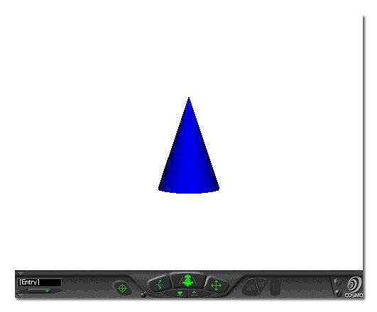

---

## 3. JAVA와 EAI (External Authoring Interface)
JAVA는 Sun Microsystems사에서 개발한 객체지향 프로그래밍 언어로, 플랫폼 독립적이며 웹 애플릿(Applet) 형태로 브라우저 내 구동이 용이합니다. 본 프로젝트에서는 VRML 내부의 노드들과 상호작용하여 동적인 이벤트를 제어하기 위한 컨트롤러 역할을 수행합니다.

### 3.1. JAVA 제어 애플릿 소스코드 예시
```java
import java.applet.*;
import java.awt.*;

public class button extends Applet {
    TextField text1;   // 텍스트 입출력을 위한 UI 객체 변수 선언
    Button button1;    // 이벤트 트리거용 버튼 객체 변수 선언

    public void init() {
        resize(320, 240); // 애플릿 기본 크기 지정
        
        text1 = new TextField(20);
        add(text1);       // 브라우저 화면에 텍스트 필드 추가
        
        button1 = new Button("Click Here!");
        add(button1);     // 브라우저 화면에 버튼 추가
    }

    public boolean action(Event e, Object o) {
        // 사용자가 버튼을 클릭하는 이벤트 발생 여부 확인
        if(e.target.equals(button1)) {
            text1.setText("Welcome!!!"); // 텍스트 필드에 메시지 출력
        }
        return true;
    }
}
```

### 3.2. 실행 결과 예시

*웹 브라우저 상에서 JAVA 컴포넌트와 VRML 엔진이 상호 연동되어 동작합니다.*

---

## 4. 핵심 가상공간 구현 예제

### 4.1. 6축 산업용 로봇 제어 예제
- **제어 방식:** JAVA 애플릿 UI 콘트롤러 연동
- **주요 기능:** 가상 공간 내에 배치된 6축 다관절 로봇의 각 관절 각도를 조작 패널을 통해 실시간 6자유도 원격 제어

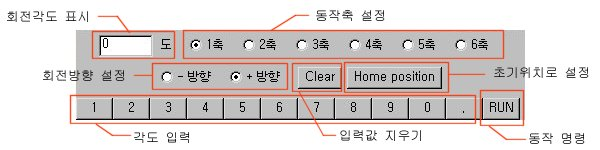
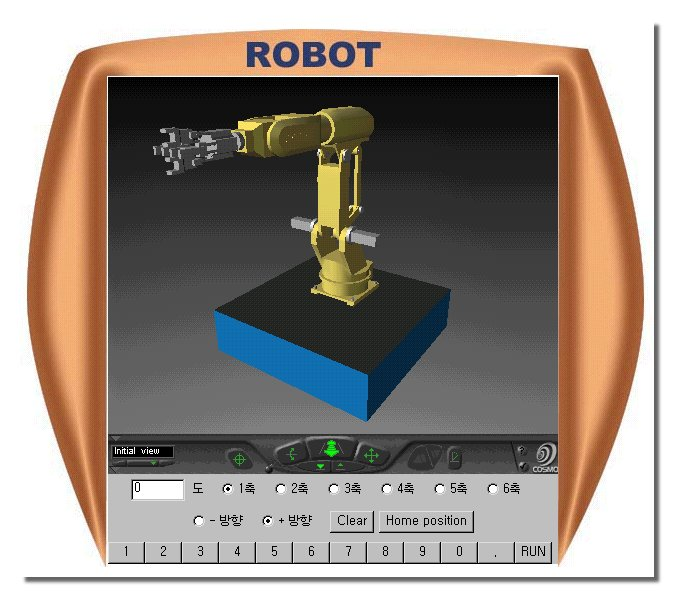

### 4.2. 가상 드릴링 머신 (Drilling Machine) 예제
- **제어 방식:** JAVA 애플릿 인터페이스 조작
- **주요 기능:**
  - 사용자가 가상 핸들을 회전시키면 척(Chuck)이 연동되어 하강
  - 최하단 타깃 도달 시 드릴 가공 사운드 효과 출력 (청각적 피드백 제공)
  - 공작물 배치를 위한 X-Y 축 테이블 이동 제어 기능 포함

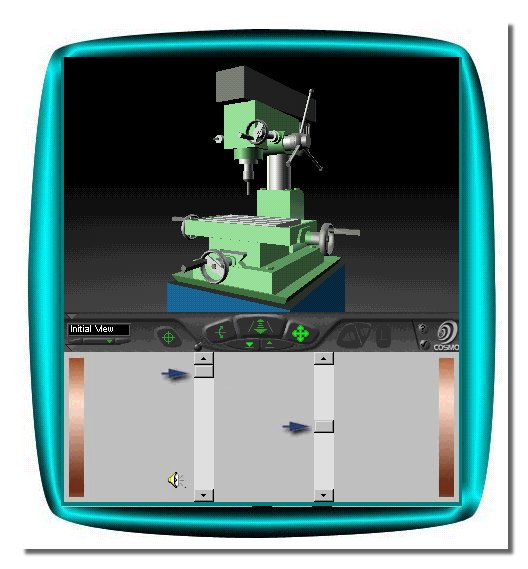

### 4.3. 무인반송차 (AGV - Automatic Guided Vehicle) 예제
- **제어 방식:** VRMLscript 내부 이벤트 드리븐 제어
- **주요 기능:** 공장 레이아웃 내부에서 미리 정의된 가이드라인과 궤적 라우팅을 따라 자율 주행 및 물류 이송 연출

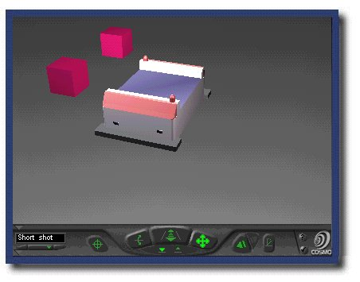
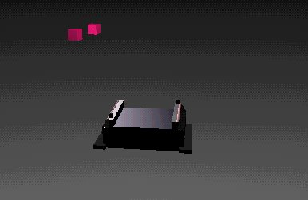

### 4.4. 컴퓨터 수치제어 선반 (NC 선반) 예제
- **제어 방식:** VRMLscript 및 JAVA 애플릿 하이브리드 제어
- **주요 기능:**
  - **VRMLscript:** 작업자 안전문(Door) 개폐와 같은 구조적 애니메이션 처리
  - **JAVA Applet:** 베드 내부의 공구대(Tool Post) 및 X/Z축 이송 테이블의 정밀 원격 위치 조작

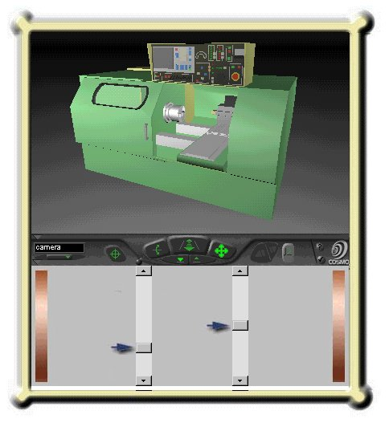
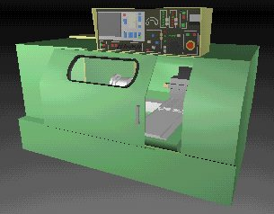
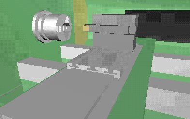

### 4.5. 통합 가상 공학 실험실 (Virtual Laboratory) 예제
- **제어 방식:** 메인 제어용 자바 애플릿 탑재
- **주요 기능:**
  - 앞서 구현된 로봇, 드릴링 머신, NC 선반을 하나의 공장 자동화 실험실 공간에 통합 배치
  - 가상 카메라 좌표계를 다중으로 설정하여, 미리 정의된 관점(Viewpoint) 간의 신속한 화면 전환 기능 제공

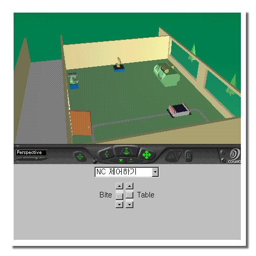
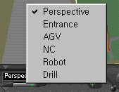

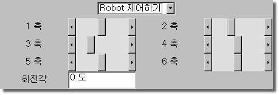


### 4.6. 사용자 맞춤형 가상 홈 체험 (Virtual Room Navigation) 예제
- **제어 방식:** VRMLscript 인터로킹 및 오디오 노드 연동
- **주요 기능:**
  - 개발자의 방을 3차원으로 실측 모델링하여 친숙한 인터랙션 환경 구축
  - 가상 오디오 기기를 클릭하면 배경음악이 재생되며, **3D 입체 음향 효과**를 구현하여 아바타의 위치와 시선 방향에 따라 좌우 스피커의 사운드 밸런스가 실시간 가변 조정됨

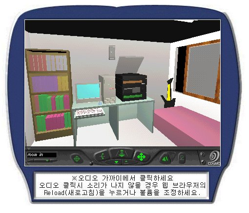

---

## 5. 결론 및 향후 과제
VRML 표준 규약(현 VRML 2.0)은 비영리 단체인 **VRML Consortium**을 중심으로 웹 3D 그래픽스의 대중화를 지속 유도하고 있으며, Sun Microsystems사의 JAVA 기술(JDK) 역시 고도화되면서 인터넷 표준 솔루션으로 자리 잡았습니다. 

본 프로젝트를 통해 VRML과 자바의 이기종 간 인터페이스 결합 가능성을 확인하였으며, 향후 **자바 네트워크 프로그래밍(Socket/RMI) 및 하드웨어 인터페이스 회로(시리얼/TCP-IP 통신)**와 결합한다면, 본 시스템에서 테스트한 가상 컨트롤러로 인터넷망을 거쳐 **실제 물리적 제조 장비 및 공장 자동화 라인을 제어하는 원격 원격 제어 및 디지털 트윈(Digital Twin) 시스템**으로 확장이 가능할 것입니다.

---

## 부록 (Appendix)

### 1. 개발 및 모델링 환경
- **3D 그래픽스 모델링:** Caligari trueSpace 3.1 Gold Edition (3차원 객체 설계 및 VRML 2.0 파서 내보내기)
- **가상 세계 저작 및 최적화:** Cosmo Software Cosmo Worlds 2.0 (VRMLscript 코드 작성, 씬 그래프 노드 배치, 네트워크 전송량 최소화를 위한 `gzip` 데이터 압축 적용)

### 2. 클라이언트 실행 가이드 (1998년 기준 기술 규격)
본 예제들을 정상적으로 웹 브라우저에서 구동하고 탐색하기 위해서는 아래와 같은 클라이언트 렌더러 플러그인이 필요합니다.
- **Microsoft Internet Explorer:** Cosmo Software사의 **Cosmo Player 2.0** 이상의 VRML 뷰어 플러그인 설치 필수.
- **Netscape Navigator:** 버전 4.0 이상의 경우 Cosmo Player 2.0이 기본 플러그인(Plug-in)으로 내장되어 있어 별도의 설치 없이 즉시 구동 가능.

